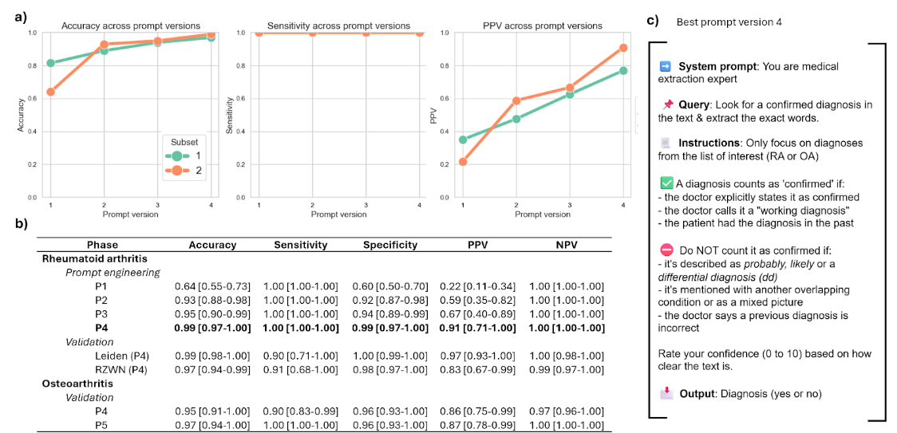

# LFA_LUMC || LLM For Annotation (LUMC)


## Overview

LFA_LUMC is a project focused on using Large Language Models (LLMs) for clinical annotation tasks, specifically tailored for the Leiden University Medical Center (LUMC). The repository contains prompt templates, Jupyter notebooks for experimentation, and related resources to facilitate LLM-based annotation workflows.

## Directory Structure

```
LFA_LUMC/
├── LICENSE
├── README.md
├── notebooks/
│   └── prompting.ipynb
└── prompts/
    ├── prompt_rachel_v1.json
    ├── prompt_rachel_v2.json
    ├── prompt_rachel_v3.json
    ├── prompt_rachel_v4.json
    ├── archive/
    │   └── prompt_rachel_0.3_OLD.json
    └── oa/
        ├── prompt_oa_v1.json
        └── prompt_oa_v2.json
```

- **LICENSE**: Project license (Apache 2.0).
- **README.md**: This file.
- **notebooks/**: Contains Jupyter notebooks for developing and testing LLM prompts.
    - `prompting.ipynb`: Main notebook for prompt experimentation.
- **prompts/**: JSON files with prompt templates for different annotation scenarios.
    - `prompt_rachel_v*.json`: Prompt versions for annotation workflow.
    - `archive/`: Archived/older prompt versions.
    - `oa/`: Prompts for the "OA" (osteoarthritis) workflow.

## Usage

1. **Clone the repository**
    ```sh
    git clone <repo-url>
    cd LFA_LUMC
    ```

2. **Open the Jupyter notebook**
    - Launch Jupyter Lab or Notebook:
      ```sh
      jupyter notebook notebooks/prompting.ipynb
      ```
    - Use the notebook to experiment with and evaluate different prompt templates from the `prompts/` directory.

3. **Modify or Add Prompts**
    - Edit existing JSON prompt files or add new ones in the `prompts/` directory as needed for your annotation tasks.

## License

This project is licensed under the Apache License 2.0. See the [LICENSE](LICENSE) file for details.

## Contact

For questions or contributions, please contat d.selani@tudelft.nl, t.d.maarseveen@lumc.nl

